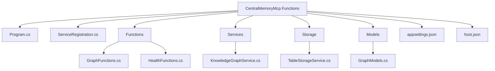

# Central Memory MCP Server (.NET 10 Azure Functions)
[](https://archestra.ai/mcp-catalog/mwgmorningwood__central-memory-mcp)

Model Context Protocol (MCP) compliant memory & knowledge graph server implemented in .NET 10 (Azure Functions isolated worker). Provides durable project memory (entities, relations, observations) for AI assistants with workspace isolation and simple HTTP tool endpoints.

## Implemented MCP Tools
Current function set (alpha stage):
- read_graph – returns all entities for a workspace (relations currently queried separately and joined)
- upsert_entity – create or update entity (preserves existing Id if name exists)
- upsert_relation – create or update relation between two entities (requires GUIDs or resolvable names)
- get_entity_relations – list relations originating from a specific entity
- Health & Ready endpoints (/api/health, /api/ready)

Planned (not yet implemented): search_entities, search_relations, stats, temporal, batch operations, merge/detect duplicates.

## Data Model
- Entities table: PartitionKey = WorkspaceName, RowKey = Guid (Id)
- Relations table: PartitionKey = WorkspaceName, RowKey = Guid (Id)
- Workspaces table (future expansion)

Observations stored as a single delimited string ("||") internally; split into List<string> at read time.

## Quick Start
```bash
dotnet restore
dotnet build
func start --port 7071
curl http://localhost:7071/api/health
```
To read the graph, invoke the read_graph MCP tool from the client and supply the workspaceName parameter.

## Directory Layout


## Usage Notes
- Use workspaceName consistently; workspaceId in docs replaced.
- Upsert preserves entity identity by lookup on (WorkspaceName + Name).
- Relation upsert requires entity GUIDs or resolves names; fails if names missing.

## Logging & Telemetry
Add Application Insights connection to capture request latency & storage dependency tracking (future enhancement).

## Roadmap
Add search, pagination, stats aggregation, batch operations, duplicate detection, merge strategy, semantic vector layer.

## License
[MIT](./LICENSE).
