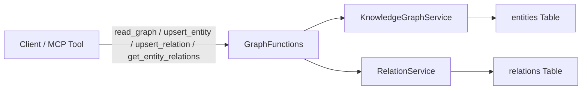
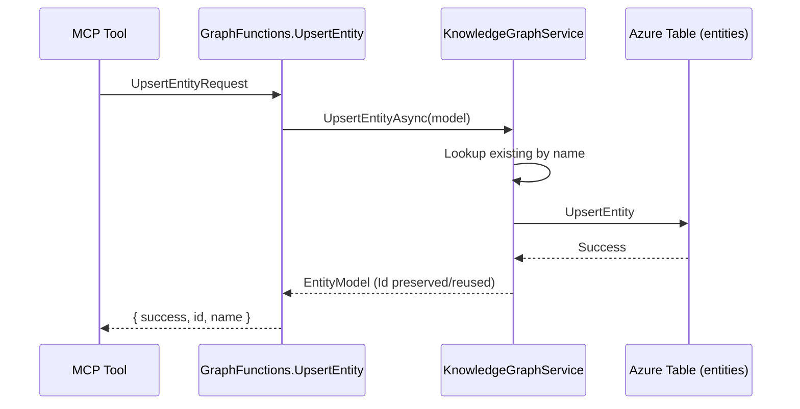

# Architecture Guide (.NET Implementation)

## Overview
The Central Memory MCP Server is a serverless Azure Functions (.NET 10 isolated worker) application exposing Model Context Protocol (MCP) memory & knowledge graph operations. It stores entities, relations, observations, and statistics in Azure Table Storage with strong workspace isolation.

Serverless Azure Functions (.NET 10 isolated) implementing a minimal MCP memory graph (alpha). Current scope: entities + relations with basic CRUD and graph read. Workspace isolation via `WorkspaceName` partition key.

## High-Level Diagram



## Implemented Components

1. GraphFunctions - MCP tool bindings (4 tools implemented).
2. HealthFunctions - `/api/health`, `/api/ready`.
3. KnowledgeGraphService - entity upsert, single entity lookup, full workspace read.
4. RelationService - relation upsert, relations-from-entity lookup, workspace relations list.
5. TableStorageService - ensures existence of tables and returns clients.
6. Models - `EntityModel`, `RelationModel`, `WorkspaceModel` (workspace not yet used in tool surface).

## Data Model

```csharp
public record EntityModel(string WorkspaceName, string Name, string EntityType, List<string> Observations, string? Metadata)
// PartitionKey = WorkspaceName, RowKey = Guid (Id)
// Observations persisted joined by "||" delimiter

public record RelationModel(string WorkspaceName, Guid FromEntityId, Guid ToEntityId, string RelationType, string? Metadata)
// PartitionKey = WorkspaceName, RowKey = Guid (Id)
```

## Storage

- Tables: entities, relations, (workspaces reserved)
- Partition strategy: simple partition per workspace for both tables.
- Row keys: GUID for stability (names may contain special chars).

## Operations Flow (Entity Upsert)



## Error Handling

- Request validation (required fields checked). Returns `{ success=false, message="..." }`.
- Relation upsert fails if source/target not resolvable.
- Missing entity in get_entity_relations returns friendly message.

## Logging

(Planned) Structured logging with workspace scope; currently minimal.

## Security

Development assumes trusted environment; add auth (Azure AD) before external exposure.

## Roadmap

- Additional tools: search, stats, batch operations.
- Metadata merge & observation limit controls.
- Duplicate detection & merge.
- Vector similarity index.

## Deployment

Publish via `dotnet publish` and Azure Functions tooling. Health endpoints for readiness probes.
